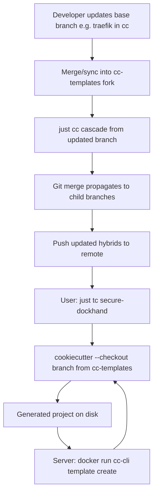

# Architecture — Two Repos, One Engine

## Repository split

| Repo | Role | Branch contents |
|------|------|-----------------|
| **`cc`** (this repo) | CLI engine + **base** template branches | `main` = Python CLI; `traefik`, `dockhand`, `py3.12` = base blocks |
| **`cc-templates`** (separate repo) | **All self-hosted Docker templates** + registry | `immich`, `vaultwarden`, `dockhand`, `traefik--secure--*`, `registry.json` |

**Golden rule:** The **catalog of services** lives in `cc-templates`. The `cc` repo ships the CLI and Docker image; optional base branches in `cc` sync into `cc-templates`. Hybrids are composed there via Git merge + cascade.

See [09-cc-templates-catalog.md](09-cc-templates-catalog.md).

## Remotes in local `cc` clone

Typical setup (observed):

```
origin    → github.com/gaurav-mistary/cc          (engine + bases)
templates → github.com/gaurav-mistary/cc-templates (fork with hybrids)
```

The templates remote may have branches not present locally on `origin`, e.g. `traefik--secure--dockhand` exists on `templates` but not on `origin/cc`.

## End-to-end flow



## Server runtime (Docker)

Users pull the **`cc` Docker image** (built from this repo) and run `template create` — no local Python install. The container uses `TEMPLATES_REPO_URL` as the Git origin and resolves branches via `CC_REGISTRY`.

See [10-docker-server-runtime.md](10-docker-server-runtime.md).

## Components in `cc` (main branch)

| Path | Purpose |
|------|---------|
| `cc/cli.py` | Typer CLI: `cascade`, `init`, `mix`, `template create` |
| `cc/cascade.py` | Recursive merge engine |
| `justfile` + `cc.just` + `tc.just` | Task runner wrappers |
| `Dockerfile` | Containerized `cc-cli` (`ENTRYPOINT python -m cc.cli`) |
| `.github/workflows/cascade.yml` | Auto-cascade on merged PRs |

## Registry indirection

Users type aliases; `registry.json` maps alias → branch name:

```json
{
  "secure-dockhand": "traefik--secure--dockhand",
  "webserver": "traefik--secure"
}
```

Loaded from `~/.cc-registry.json` or URL via `CC_REGISTRY` env var. Default templates repo: `https://github.com/gaurav-mistary/cc-templates.git`.

## Environment variables

| Variable | Used by | Purpose |
|----------|---------|---------|
| `FACTORY_URL` | `init`, `mix` | Template repo URL |
| `TEMPLATES_REPO_URL` | `template create` | Templates fork URL |
| `CC_REGISTRY` | `template create` | Path or URL to registry JSON |
| `GEMINI_API_KEY` | (planned) | AI merge conflict resolution |

See `.env.example` for defaults (`TEMPLATES_REPO_URL`, `CC_REGISTRY`, `FACTORY_URL`).
