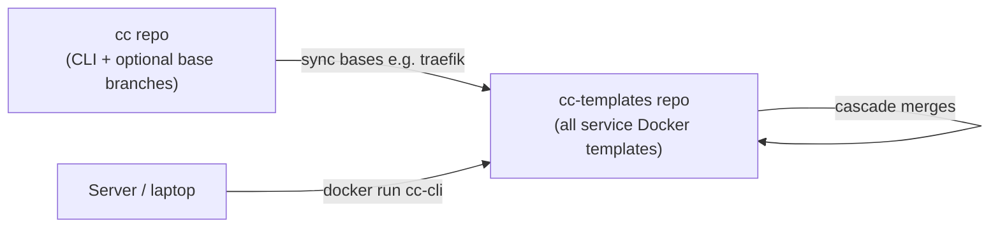

# cc-templates — Self-Hosted Service Catalog

## Purpose

`cc-templates` is a **separate GitHub repository** from `cc`. It is the **template library** — not the CLI engine.

It holds Cookiecutter templates (one Git branch each) for every self-hosted stack the user runs or wants to run on a homelab/server:

| Category | Examples (planned / existing) |
|----------|-------------------------------|
| Reverse proxy / TLS | `traefik`, `traefik--secure` |
| Admin / ops | `dockhand` |
| Media | `immich`, `audiobookshelf` |
| Secrets | `vaultwarden` |
| Backups | `backups` (branch TBD) |
| Language bases | `py3.12` (synced from `cc` if needed) |
| Composed stacks | `traefik--secure--dockhand`, `traefik--immich`, etc. |

Each branch root = valid Cookiecutter template (`cookiecutter.json` + `{{cookiecutter.project_slug}}/`).

## Relationship to `cc`



| Repo | Owns |
|------|------|
| **`cc`** | `cc-cli` Python package, cascade logic, Docker image build, optional upstream base branches |
| **`cc-templates`** | Every branch a user might generate from; `registry.json` aliases; hybrid compositions |

**Earlier docs** described `cc-templates` as "a fork of cc" — that was the bootstrap path. **Target state:** `cc-templates` is the canonical home for service templates; bases may originate in `cc` and sync in, but new services (immich, vaultwarden, …) are added directly on `cc-templates`.

## registry.json

Maps short names → branch names so users (and the Docker container) don't type `traefik--secure--immich`:

```json
{
  "webserver": "traefik--secure",
  "dockhand": "traefik--secure--dockhand",
  "immich": "immich",
  "photos": "traefik--secure--immich",
  "audiobooks": "audiobookshelf",
  "vault": "vaultwarden"
}
```

Hosted at raw GitHub URL; consumed via `CC_REGISTRY` env var.

Default repo URL in CLI: `https://github.com/gaurav-mistary/cc-templates.git`

## Branch naming for services

- **Standalone service:** branch name = service name → `immich`, `vaultwarden`, `audiobookshelf`
- **Service behind Traefik + TLS:** compose via cascade → `traefik--secure--immich`
- **Shared infra mixin:** `traefik`, `traefik--secure`, `backups` as layers merged into stacks

## Workflow: adding a new self-hosted app

1. Create branch on `cc-templates` with Cookiecutter layout (compose, env example, README).
2. If it needs Traefik/TLS, create hybrid branch and merge parent layers (or cascade from updated parent).
3. Add alias to `registry.json` on `main`.
4. Generate locally: `just tc new immich` or on server via Docker (see [10-docker-server-runtime.md](10-docker-server-runtime.md)).
5. Optionally sync shared base changes from `cc` → `cc-templates`, then `just cc cascade`.

## Current branches (observed)

On `templates` remote:

- `main`, `dockhand`, `py3.12`, `traefik`, `traefik--dockhand`, `traefik--secure`, `traefik--secure--dockhand`

**Not yet present:** `immich`, `audiobookshelf`, `vaultwarden`, `backups` — tracked as catalog gaps in [08-roadmap.md](08-roadmap.md).
